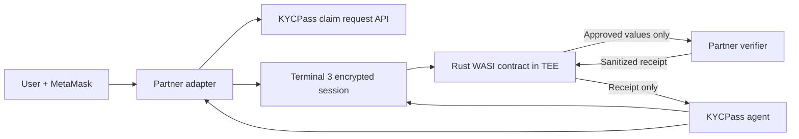

# KYCPass

**Verify once. Disclose only what a service needs. Keep the document.**

KYCPass is reusable identity infrastructure built on Terminal 3. A user creates
one wallet-bound, protected identity profile; any integrated platform can then
request a minimal set of KYC claims through an embedded adapter. The user sees
the exact request, approves it with MetaMask, and receives a sanitized receipt
after the verifier accepts the disclosure.

Documents do not move between platforms, agents do not receive plaintext PII,
and partners do not need to build separate document-provider integrations.

## Why it exists

KYC is usually implemented as repeated document collection. The same person
uploads the same identity document to every bank, exchange, marketplace, or
regulated application. Every copy increases onboarding friction, integration
cost, breach exposure, and deletion obligations.

KYCPass changes the integration boundary from **send us your document** to
**prove these specific claims**.

## How it works

1. **Create a private identity.** The user connects MetaMask and authenticates a
   real `did:t3n` on Terminal 3.
2. **Verify the source.** Terminal 3 verifies the user's email by OTP. KYCPass
   validates a UIDAI Paperless Offline e-KYC signature locally in the browser,
   maps supported fields, and discards the source XML.
3. **Protect the profile.** The mapped fields are submitted through Terminal 3's
   encrypted browser SDK and produce the genuine Level-1 credential
   `t3n.user-input.kyc.1`.
4. **Request minimum claims.** A partner asks for typed claim IDs and declares
   its purpose and verifier callback URL.
5. **Approve an exact grant.** MetaMask signs a Terminal 3 grant scoped to one
   agent DID, contract, function, version, and verifier host.
6. **Disclose inside the TEE.** A Rust WASI Preview 2 contract converts approved
   claim IDs to fixed profile placeholders. Terminal 3 resolves those values
   after the WASM boundary and sends them directly to the partner verifier.
7. **Return evidence, not identity.** KYCPass receives a sanitized receipt with
   the verifier, accepted claim categories, credential level, and timestamp.

## Architecture



The end-user wallet DID and KYCPass developer/agent DID are separate identities
with separate signing paths. The browser authenticates the user; the server key
invokes only grants the user has approved.

## What makes it different

- **Claims, not copies:** partners request `full_name`, `verified_email`, or
  `country_of_residence`, not an Aadhaar file.
- **Deterministic minimization:** unknown, added, duplicated, or mismatched
  claims are rejected instead of being decided by an AI agent.
- **Human-controlled disclosure:** every execution is bound to a visible
  purpose, exact claim set, verifier host, contract, and function.
- **TEE-resolved values:** the agent operates on claim identifiers and fixed
  placeholders; Terminal 3 resolves protected values inside the execution path.
- **Reusable infrastructure:** partners integrate a request API, browser
  adapter, and verifier callback instead of integrating UIDAI, DigiLocker, and
  Terminal 3 separately.
- **Honest evidence:** receipts, audit responses, and token usage are displayed
  exactly as returned. KYCPass does not fabricate Level-2 approval or VCs.

## Partner integration

Create a scoped request:

```http
POST /api/partners/kyc-request
Content-Type: application/json
```

```json
{
  "partner": {
    "id": "northstar-digital-bank",
    "name": "Northstar Digital Bank",
    "origin": "https://bank.example",
    "verifierUrl": "https://bank.example/api/kycpass/verifier"
  },
  "purpose": "Open a regulated savings account and satisfy identity checks.",
  "requestedClaims": ["full_name", "verified_email", "country_of_residence"]
}
```

Embed the adapter in the partner's own profile page:

```tsx
<PartnerKycAdapter
  kycpassOrigin="https://kyc-pass.vercel.app"
  t3RelayOrigin="https://bank.example"
  partnerId="northstar-digital-bank"
  partnerName="Northstar Digital Bank"
  verifierUrl="https://bank.example/api/kycpass/verifier"
  purpose="Open a regulated savings account and satisfy identity checks."
  requestedClaims={["full_name", "verified_email", "country_of_residence"]}
/>
```

Northstar is included as a sample relying party, not as privileged KYCPass
logic. The same API and adapter can be embedded by any approved platform.

## Use cases

- Banks, fintech products, and exchanges requesting reusable KYC claims
- Marketplaces verifying sellers without retaining document copies
- Age, residency, or jurisdiction checks for restricted services
- Employment and contractor onboarding using scoped identity attributes
- Travel, telecom, insurance, and rental platforms requiring verified identity
- AI agents completing regulated actions without receiving raw user profiles

## Privacy and security boundaries

| Data | Route | KYCPass server sees it |
|---|---|---|
| Wallet signature | MetaMask to Terminal 3 | No |
| OTP | Encrypted Terminal 3 browser session | No |
| Aadhaar Offline e-KYC XML | Parsed and verified locally | No |
| Protected profile values | Browser to Terminal 3 user contract | No |
| Approved values | Terminal 3 TEE to partner verifier | No |
| Developer key | Server environment only | Yes |
| Sanitized receipt | Verifier to contract to KYCPass | Yes |

The current document adapter establishes the integrity of a UIDAI-signed source
artifact and issues an honest Terminal 3 Level-1 user-input credential. Level 2
is provider-backed identity and liveness verification; KYCPass displays genuine
Level-2 status and VC IDs when available but does not call an undocumented
provider-initiation flow or simulate approval.

## Milestones delivered

- Real MetaMask authentication and stable Terminal 3 testnet sessions
- Terminal 3 email OTP and protected Level-1 profile ingestion
- Browser-only UIDAI Offline e-KYC XML signature verification
- Deterministic claim minimization and scoped grant construction
- Deployed Rust WASI Preview 2 disclosure contract
- Terminal 3 TEE execution through `http-with-placeholders`
- Generic partner request API, embedded adapter, and external verifier callback
- Sanitized receipt validation, audit presentation, and token-usage dashboard
- First-party session-affinity relay for strict browser privacy settings
- Architecture, security, partner integration, deployment, and demo guides

## Stack

- Next.js 16, React 19, TypeScript, Tailwind CSS v4, shadcn/ui
- Zustand, Zod, React Hook Form, Lucide React
- `@terminal3/t3n-sdk` 3.5.2
- Rust, `wit-bindgen`, WASI Preview 2
- Vitest and Playwright

## Local development

Prerequisites: Node.js 20+, pnpm, Rust, MetaMask, and a Terminal 3 developer
API key and DID.

```bash
pnpm install
rustup target add wasm32-wasip2
cp .env.example .env.local
pnpm dev
```

Set every required value in `.env.local`. For live contract execution,
`NEXT_PUBLIC_VERIFIER_ORIGIN` must be a public HTTPS origin reachable from the
Terminal 3 TEE.

### Contract and verification

```bash
pnpm contract:test
pnpm contract:clippy
pnpm contract:build
pnpm t3:deploy
pnpm t3:check

pnpm typecheck
pnpm lint
pnpm test
pnpm build
pnpm test:e2e
```

The full MetaMask and OTP path requires real user interaction and is not mocked
by the browser smoke suite.

## Documentation

- [Architecture](docs/ARCHITECTURE.md)
- [Security and privacy](docs/SECURITY.md)
- [Partner integration](docs/PARTNER-INTEGRATION.md)
- [Separate partner deployment](docs/NORTHSTAR-SEPARATE-APP.md)
- [Document sources](docs/DOCUMENT-SOURCES.md)
- [Deployment](docs/DEPLOYMENT.md)
- [Testing](docs/TESTING.md)
- [Submission copy](docs/SUBMISSION.md)
- [Demo script](docs/DEMO.md)
- [Handover](docs/HANDOVER.md)

## Current scope

The judged flow implements Level 1, consent, TEE disclosure, partner receipt,
audit responses, and token usage on Terminal 3 testnet. DigiLocker remains an
approved-provider integration boundary rather than a simulated data source.
Level-2 initiation and the Chrome extension are deliberately outside the core
demo until documented provider access and the web security boundary are stable.
