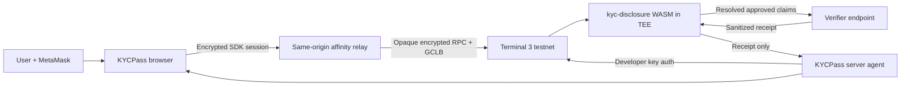
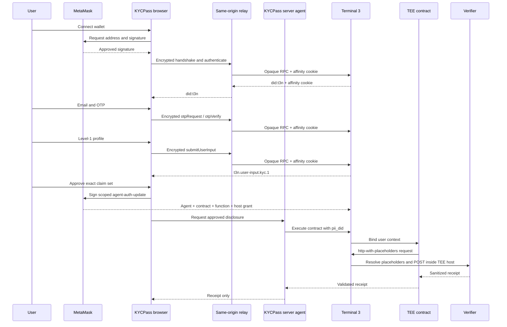

# Architecture

## Components

The browser authenticates the end-user DID. The same-origin relay preserves
Terminal 3 node affinity without reading encrypted SDK payloads. The server
authenticates the developer/agent DID. These are separate identities and
separate signing paths.

Terminal 3 durably binds the protected user record and credentials to the DID.
After a fresh MetaMask authentication, KYCPass restores only non-PII completion
markers from a DID-keyed browser cache so the UI does not incorrectly present
an existing user as new. Those markers are never treated as proof or sent to a
verifier.

## Disclosure sequence

## Data ownership

| Data | Owner and path | KYCPass server access |
|---|---|---|
| Wallet signature | MetaMask to Terminal 3 SDK | No |
| OTP | Browser to Terminal 3 SDK | No |
| Profile fields | Browser to protected user contract | No |
| Completion markers | DID-keyed browser cache, non-authoritative | No |
| Developer key | Server environment | Yes, server only |
| Verifier secret | Server environment to encrypted contract input | Yes, server only |
| Resolved claims | Terminal 3 host to verifier | No |
| Receipt | Verifier to contract to server/browser | Yes, sanitized |

## Deterministic policy

The verifier selects claim identifiers from a fixed catalog. The policy removes
duplicates, rejects unknown identifiers, rejects additions, and requires the
approved set to equal the requested set. An AI parser can later translate prose
into a draft request, but it must never approve claims or execute disclosure.
